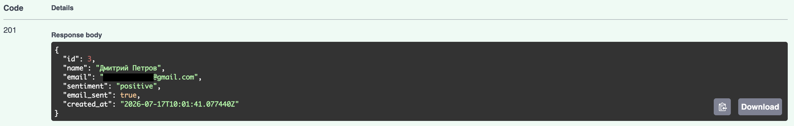
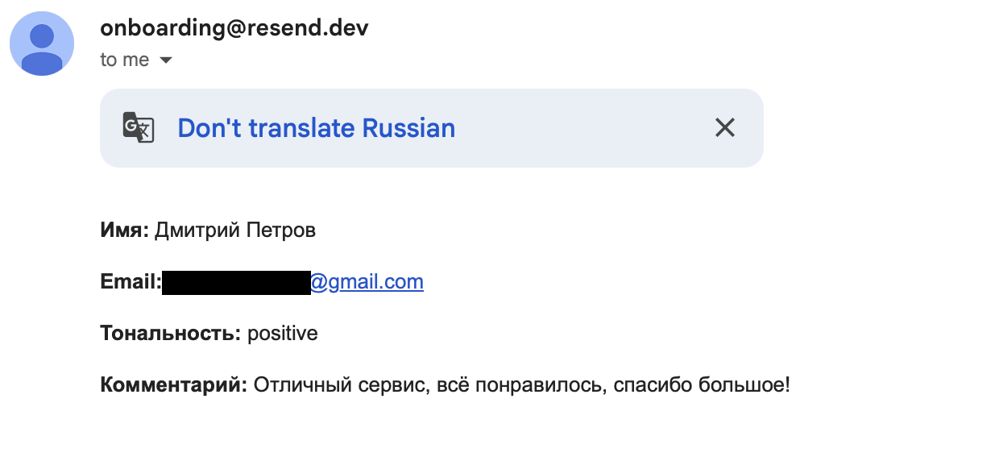
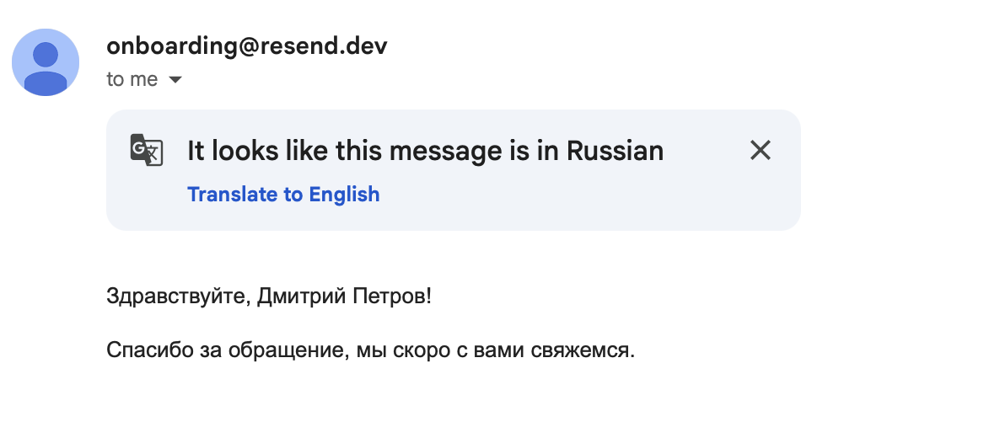

# Feedback Service

Backend-сервис для формы обратной связи с AI-анализом тональности комментариев и email-уведомлениями.

## Стек технологий

- **Backend:** Python 3.11, FastAPI (async), SQLAlchemy 2.0 (async)
- **БД:** PostgreSQL 16
- **Миграции:** Alembic
- **AI:** Groq API (модель llama-3.1-8b-instant) — анализ тональности комментария
- **Email:** Resend API — уведомление владельцу и пользователю
- **Инфраструктура:** Docker, docker-compose

## Как запустить локально

### 1. Клонируйте репозиторий

```bash
git clone https://github.com/kit-kosatka/feedback-service.git
cd feedback-service
```

### 2. Настройте переменные окружения

```bash
cp .env.example .env
```

Откройте `.env` и заполните:

```env
GROQ_API_KEY=            # https://console.groq.com/keys
RESEND_API_KEY=          # https://resend.com/api-keys
EMAIL_FROM=onboarding@resend.dev
OWNER_EMAIL=             # ваш email, зарегистрированный в Resend
```

> Без верификации домена в Resend письма можно отправлять только на email, которым вы зарегистрированы в Resend.

### 3. Запустите проект

```bash
docker compose up --build
```

При первом запуске примените миграции (в отдельном терминале):

```bash
docker compose exec app alembic upgrade head
```

### 4. Проверьте

- Swagger UI: http://localhost:8000/docs
- Health check: http://localhost:8000/api/health

## Архитектура

Слоистая структура: `Controllers (api) → Services → Repositories`
```
app/
├── main.py              # точка входа, регистрация роутеров и middleware
├── core/
│   ├── config.py         # настройки из .env (pydantic-settings)
│   ├── logging.py        # настройка логирования в файл
│   └── exceptions.py     # глобальный обработчик ошибок
├── db/
│   ├── base.py            # базовый класс моделей SQLAlchemy
│   └── session.py         # async engine, фабрика сессий
├── models/
│   └── contact.py         # модель ContactRequest
├── schemas/
│   └── contact.py         # Pydantic-схемы запроса/ответа
├── repositories/
│   └── contact_repository.py   # доступ к данным (SQL-запросы)
├── services/
│   ├── ai_service.py             # анализ тональности (Groq)
│   ├── email_service.py          # отправка писем (Resend)
│   └── contact_service.py        # бизнес-логика: связывает всё вместе
├── api/v1/
│   ├── contact.py          # POST /api/contact
│   ├── health.py           # GET /api/health
│   └── metrics.py          # GET /api/metrics
└── middleware/
    └── rate_limit.py        # ограничение частоты запросов
   ```
Контроллер ничего не знает про SQL или AI/email-провайдеров — он только принимает HTTP-запрос и вызывает сервис. Сервис содержит бизнес-логику (в каком порядке вызывать AI, email, сохранение). Репозиторий отвечает только за доступ к БД.

## API

### `POST /api/contact`

Принимает обращение, анализирует тональность, отправляет email-уведомления, сохраняет в БД.

**Запрос:**

```json
{
  "name": "Иван Иванов",
  "phone": "+79991234567",
  "email": "ivan@example.com",
  "comment": "Отличный сервис, всё понравилось!"
}
```

**Валидация:** имя (2-100 символов), телефон (5-20 символов), email (валидный формат), комментарий (10-2000 символов). При ошибке — `422` со списком проблемных полей.

**Ответ (201):**

```json
{
  "id": 1,
  "name": "Иван Иванов",
  "email": "ivan@example.com",
  "sentiment": "positive",
  "email_sent": true,
  "created_at": "2026-07-17T09:05:43Z"
}
```

**Rate limiting:** не более `RATE_LIMIT_REQUESTS` запросов за `RATE_LIMIT_WINDOW_SECONDS` секунд с одного IP (по умолчанию 5 запросов/60 секунд). При превышении — `429`.

### `GET /api/health`

Проверка статуса сервиса. Ответ: `{"status": "ok"}`.

### `GET /api/metrics`

Статистика по обращениям.

```json
{
  "total_requests": 10,
  "positive": 6,
  "neutral": 3,
  "negative": 1
}
```

## AI-интеграция

Используется Groq API (Llama-модель) для классификации тональности комментария: `positive` / `neutral` / `negative`.

**Fallback:** если Groq недоступен (таймаут, невалидный ключ, лимит запросов) — исключение перехватывается, в лог пишется traceback, `sentiment` сохраняется как `null`, а весь остальной цикл (email, сохранение в БД) продолжает работать. Сервис никогда не падает из-за недоступности AI.

## Ограничение email (тестовый режим Resend)

Без верификации собственного домена в Resend можно отправлять письма только на email, которым вы зарегистрированы в Resend (в данном случае — значение переменной `OWNER_EMAIL`). Если в поле `email` формы указан другой адрес, Resend отклонит отправку письма пользователю, `sentiment` и запись в БД при этом сохранятся как обычно, а `email_sent` будет `false` — это ожидаемое поведение fallback-механизма, а не ошибка.

Для продакшена нужно верифицировать домен на resend.com/domains и указывать from-адрес с этого домена — тогда ограничение снимается.
## Обработка ошибок

- Валидация входных данных — на уровне Pydantic-схем (`422` с деталями).
- Глобальный обработчик (`app/core/exceptions.py`) ловит все необработанные исключения и возвращает `500` с понятным сообщением, не показывая пользователю сырой traceback.
- Ошибки AI и email-провайдера обрабатываются локально в своих сервисах и не прерывают основной поток запроса.

## Хранение данных

- **Обращения** — в PostgreSQL, таблица `contact_requests`.
- **Логи запросов** — в файле `logs/app.log` (ротация: 5MB × 3 файла).
- **Rate limiting** — в файле `logs/rate_limit.json` (список временных меток запросов по IP за скользящее окно).
- **Статистика (`/api/metrics`)** — считается на лету из PostgreSQL по полю `sentiment`.
## Примеры запросов (curl)

```bash
curl -X POST http://localhost:8000/api/contact \
  -H "Content-Type: application/json" \
  -d '{"name":"Иван Иванов","phone":"+79991234567","email":"ivan@example.com","comment":"Отличный сервис, всё понравилось!"}'

curl http://localhost:8000/api/health

curl http://localhost:8000/api/metrics
```

## Тесты

Проект содержит базовые тесты на pytest: проверка health-эндпоинта и валидации входных данных.

Запуск:

```bash
docker compose exec app pytest -v
```

## Скриншоты работы

Ответ API при успешной отправке:


Письмо владельцу сайта:


Письмо-подтверждение пользователю:
